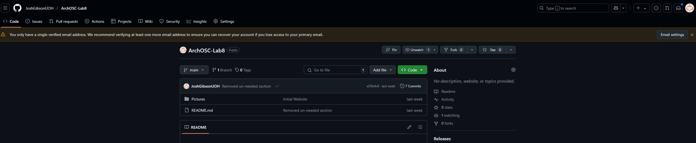
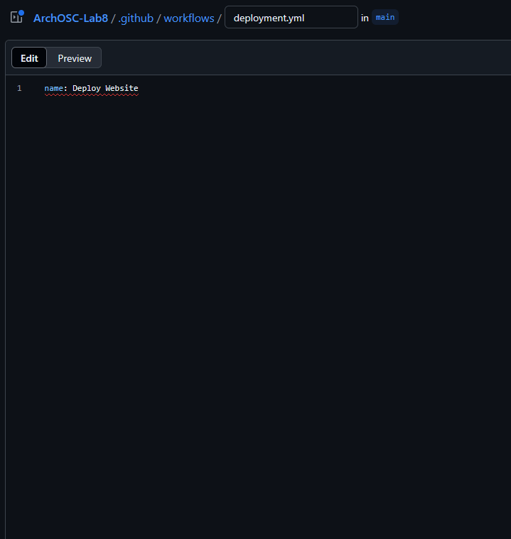
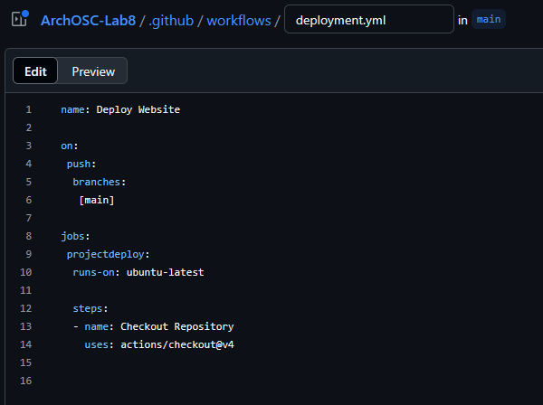
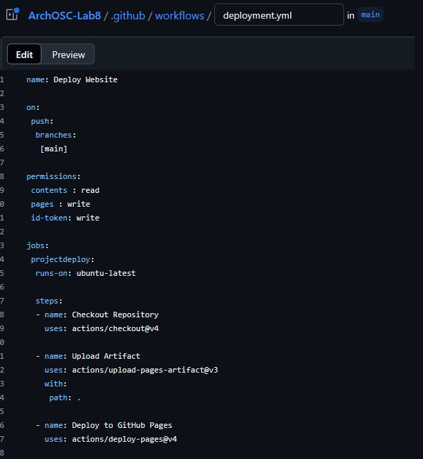

# GitHub and CICD 2: GitHub Actions and YAML
Open your GitHub repository from last week, you should be greeted with a screen like the one below: 

  

Choose the settings option at the top of the screen and you will be redirected to the settings screen. 

  

As you did last week, go to the pages section, and click on it, at the top right-hand side of the pages window (next to your websites deployment) you should see a box with three dots on it.  

Click on this and you should get an option to unpublish your site – click on this. This will unpublish your site. You then need to press the dropdown button under “Source” and choose GitHub actions.  
 
When done it should look like this. 

  

Return to the main page and select the actions button from the top of the screen, this will redirect you to the GitHub Actions window. 

  

As you have built your website using GitHub pages previously you should see the results of these CICD pipelines in the Actions window – it should look like the one below. 

  

From this GitHub actions window, select the “New Workflow” button from the top left-hand side of the screen. 

  

From here you will be redirected to the create a new workflow screen, where GitHub will ask you if you want to create a new workload from scratch, or if you want to write a pipeline of your own. 

In this instance we are going to write our own pipeline, so you should choose the “Set up a workflow yourself” link at the top of the screen. 

   

This will redirect you to the create a pipeline screen where you will start to write your YAML.  

The first thing you need to do is name your workflow; at the top of the screen, you should see a folder structure with the name of your current workflow (it should be main.yml) 

   

Change “main.yml” to be “deployment.yml” it should look like the screen below. 

  

 <html lang="en">
<head>
    <meta charset="UTF-8">
    <meta name="viewport" content="width=device-width, initial-scale=1.0">
    <!-- Bootstrap CSS -->
    <link href="https://stackpath.bootstrapcdn.com/bootstrap/4.5.2/css/bootstrap.min.css" rel="stylesheet">
</head>
<body>
<div class="container mt-5">
    <div class="alert alert-primary" role="alert">
    <svg xmlns="http://www.w3.org/2000/svg" width="16" height="16" fill="currentColor" class="bi bi-lightbulb" viewBox="0 0 16 16">
    <path d="M2 6a6 6 0 1 1 10.174 4.31c-.203.196-.359.4-.453.619l-.762 1.769A.5.5 0 0 1 10.5 13a.5.5 0 0 1 0 1 .5.5 0 0 1 0 1l-.224.447a1 1 0 0 1-.894.553H6.618a1 1 0 0 1-.894-.553L5.5 15a.5.5 0 0 1 0-1 .5.5 0 0 1 0-1 .5.5 0 0 1-.46-.302l-.761-1.77a2 2 0 0 0-.453-.618A5.98 5.98 0 0 1 2 6m6-5a5 5 0 0 0-3.479 8.592c.263.254.514.564.676.941L5.83 12h4.342l.632-1.467c.162-.377.413-.687.676-.941A5 5 0 0 0 8 1"/>
</svg> <strong>Task</strong>
Take a screenshot of this window and add it to your portfolio, explaining what you have done so far.  
    </div>
</div>

<!-- Bootstrap JS and dependencies -->
<script src="https://code.jquery.com/jquery-3.5.1.slim.min.js"></script>
<script src="https://cdn.jsdelivr.net/npm/@popperjs/core@2.9.1/dist/umd/popper.min.js"></script>
<script src="https://stackpath.bootstrapcdn.com/bootstrap/4.5.2/js/bootstrap.min.js"></script>
</body>
</html>

You are now free to start writing a CI YAML in the box provided. To do this we are going to work through step-by-step, with each section being explained individually. Your YAML file should look like the paired screenshots when you complete each section.  

The YAML commands shown here are also colour coded, parts of the command shown in orange are the YAML commands themselves, and can’t be changed, parts of the command shown in blue are the parts of the command that you can change as you see fit.  

As we mentioned in the lecture, your YAML should be split into three sections: 

The name of your CICD pipeline, the run conditions of the CICD pipeline and then the jobs that your pipeline will complete. We are going to start with the same of the pipeline. 

This is not the name of the file that we altered earlier but is instead a name of the action you are creating, this is what will show in the GitHub GUI when your action has been completed – we do this by entering 

```yaml
name: Deploy Website 
```

The “name:” command is what is important here, the value after the command can be anything you want. 

  

You will notice that the command you have just entered has a red squiggly line underneath, like in Visual Studio this means that GitHub’s YAML editor has found an error with what you have entered so far. 

If you hover over the red squiggly line, you will see that the error that is given is that your YAML file is missing the required root key “on” - this is the setting that will cover when our pipeline runs – so we will add this next. 

NOTE: When using YAML commands that are linked together should be indented using spaces when needed, the above commands are separated using more spaces to make them better fit into this document, so copy and pasting will not work. (Or will need some formatting changes to prevent errors) 

To do this enter the following: 

```yaml
on: 
 push: 
  branches: 
    [main] 
```

This command tells GitHub when we want our action to be completed, in this case you want your GitHub action to run every time you push to the main branch, this can be changed to a wide range of different things depending on how you want your workflow to run, including when people push to specific branches, or when a project is deployed. But for this example, we are going to keep it simple. 

Your YAML should now look like the image below 

  

You will see that the previous error is gone.  

The next step you need to complete is to spin up your virtual machine that will complete your actions. In this case we are going to be using a Linux (specifically Ubuntu) VM. There are a few reasons for this, but the main one is that it is the most lightweight one available to us and has the facility to complete all the tasks we need.  

Spinning up a VM (and all of the other tasks we will be completing) are considered to be “jobs” when using YAML with GitHub Actions – so in order to do this we must now introduce the jobs: command making sure to indent afterwards. 

After this we can then enter the command for spinning up our VM – which when all done will look like the example below: 

```yaml
jobs: 
 projectdeploy: 
  runs-on: ubuntu-latest 
```

As stated previously, the “jobs:” command tells GitHub that we are starting our jobs, further to this the “projectdeploy:” command is the name of our list of jobs, this is a bit of an anomaly, as we can set this to be anything that makes sense (and should be something that makes sense to make it easy to understand, but it exists on the left hand side of the colon, and is still a command that is needed. The best way to think about this is like a variables name, and not it’s value. 

If you think about this in the concept of Csharp, and we used the same colour scheme you would get something like this: 

Int number = 10 

Once we have created the job, we are looking to spin up a VM that we will be running our jobs on and the “runs-on:” command is where we specify what type of VM we are looking to create, in this case one that uses the current version of Ubuntu. 

When it is done, it should look like this. 

  

We are now ready to add further jobs that will run on our VM and allow us to complete our CI – we do this by creating a steps: section inside of our jobs: one, the steps section essentially becomes a list of tasks that will be completed when the job is ran. 

Each step should be split into two sections, a - name: section, which tells GitHub what task we are completing so it can group all of the steps underneath it as one task, and accurately represent them in the GUI and a body section under that which will contain everything that will be completed in that step. 

As the VM we have just span up is a brand-new machine with only the operating system installed we need to begin by getting our repository onto the machine so it can be worked on. To do this we are going to use a built in GitHub action called checkout. 

Underneath the previous command you entered (and at the same indent level) enter the following: 

```yaml
steps: 
 - name: Checkout Repository 
 uses: actions/checkout@v4 
```
Make sure you are careful with the indentation here – steps: should follow the same indentation level as the line above it, the “-” for – name: should be level with steps but uses: should be level with the n of name. It can be tricky to get right first time but makes sense after a few implementations. 

As mentioned previously the – name: section can be anything you want but try and make sure it makes sense! The uses: section tells GitHub actions we are using an already created action – in this case v4 of the checkout action GitHub created. You can change this to be any other action that exists just by providing the path to its repo, for example, if your lab I used would work as a GitHub action (it won’t!) you could write uses: JoshGibsonUOH/ARCHOSC-Lab10 

When you have done this your YAML should look like the screenshot below: 

   

Now you have your repo available on the VM the next step is to take it, and push it to GitHub pages 

Before we can do this, we first need to generate a “GitHub Artifact” that we can give to GitHub actions, and then by extension your GitHub pages site 

An artifact is a selection of files that the workflow commits to its memory so it can be used in other places throughout the workflow, in this case you are going to give this information to another GitHub action and then use that to deploy to GitHub pages. 

To create your artifact add the following YAML to your job list. 

```yaml
- name: Upload Artifact  
 uses: actions/upload-pages-artifact@v3  
 with:  
  path: .
```
This introduces two new YAML values, with: and path: with is an argument we give to the GitHub action that tells it that we want to use a specific file or folder, and path: is the location of that file. In this case, we use “.” for the path as we want to use our entire folder.  

When done, your YAML should look like this 

   

You now need to take your artifact and deploy it. 

We can do this using the “Deploy to GitHub Pages” action provided by GitHub, by using the following: 

```yaml
- name: Checkout Repository 
   uses: actions/deploy-pages@v4 
```

When done, it should look like this: 

  

The last thing we are going to do is add permissions to the pipeline that will allow it to push to GitHub pages without issue.  

To do this add the following YAML to your project, underneath your start-up rules but above your jobs.  

```yaml
permissions: 
 contents : read 
 pages : write 
 id-token: write 
```

This adds permissions to your pipeline that allows you to read your repository, and write your site to GitHub pages with the correct ID token. 

When done, your full YAML pipeline should look like this: 

<html lang="en">
<head>
    <meta charset="UTF-8">
    <meta name="viewport" content="width=device-width, initial-scale=1.0">
    <!-- Bootstrap CSS -->
    <link href="https://stackpath.bootstrapcdn.com/bootstrap/4.5.2/css/bootstrap.min.css" rel="stylesheet">
</head>
<body>
<div class="container mt-5">
    <div class="alert alert-primary" role="alert">
    <svg xmlns="http://www.w3.org/2000/svg" width="16" height="16" fill="currentColor" class="bi bi-lightbulb" viewBox="0 0 16 16">
    <path d="M2 6a6 6 0 1 1 10.174 4.31c-.203.196-.359.4-.453.619l-.762 1.769A.5.5 0 0 1 10.5 13a.5.5 0 0 1 0 1 .5.5 0 0 1 0 1l-.224.447a1 1 0 0 1-.894.553H6.618a1 1 0 0 1-.894-.553L5.5 15a.5.5 0 0 1 0-1 .5.5 0 0 1 0-1 .5.5 0 0 1-.46-.302l-.761-1.77a2 2 0 0 0-.453-.618A5.98 5.98 0 0 1 2 6m6-5a5 5 0 0 0-3.479 8.592c.263.254.514.564.676.941L5.83 12h4.342l.632-1.467c.162-.377.413-.687.676-.941A5 5 0 0 0 8 1"/>
</svg> <strong>Task</strong>
Take a screenshot of your YAML and add it to your portfolio, explaining what it does.  
    </div>
</div>

<!-- Bootstrap JS and dependencies -->
<script src="https://code.jquery.com/jquery-3.5.1.slim.min.js"></script>
<script src="https://cdn.jsdelivr.net/npm/@popperjs/core@2.9.1/dist/umd/popper.min.js"></script>
<script src="https://stackpath.bootstrapcdn.com/bootstrap/4.5.2/js/bootstrap.min.js"></script>
</body>
</html>

Now you have a completed YAML pipeline you can commit it and see if it runs! From the YAML creation screen press the green “commit changes” button.  

   

Enter a commit message that makes sense the same way that you would if updating a repository, when done press commit changes, and your repo will be updated with your new pipeline. 

Back in your main repository, click actions again and you should be able to see your GitHub action running. Click inside of it and you should be able to see what is happening step-by-step. 

When done, return to your GitHub settings and go back to pages, you should have a link to your newly deployed site that you can visit. 

  

<html lang="en">
<head>
    <meta charset="UTF-8">
    <meta name="viewport" content="width=device-width, initial-scale=1.0">
    <!-- Bootstrap CSS -->
    <link href="https://stackpath.bootstrapcdn.com/bootstrap/4.5.2/css/bootstrap.min.css" rel="stylesheet">
</head>
<body>
<div class="container mt-5">
    <div class="alert alert-primary" role="alert">
    <svg xmlns="http://www.w3.org/2000/svg" width="16" height="16" fill="currentColor" class="bi bi-lightbulb" viewBox="0 0 16 16">
    <path d="M2 6a6 6 0 1 1 10.174 4.31c-.203.196-.359.4-.453.619l-.762 1.769A.5.5 0 0 1 10.5 13a.5.5 0 0 1 0 1 .5.5 0 0 1 0 1l-.224.447a1 1 0 0 1-.894.553H6.618a1 1 0 0 1-.894-.553L5.5 15a.5.5 0 0 1 0-1 .5.5 0 0 1 0-1 .5.5 0 0 1-.46-.302l-.761-1.77a2 2 0 0 0-.453-.618A5.98 5.98 0 0 1 2 6m6-5a5 5 0 0 0-3.479 8.592c.263.254.514.564.676.941L5.83 12h4.342l.632-1.467c.162-.377.413-.687.676-.941A5 5 0 0 0 8 1"/>
</svg> <strong>Task</strong>
Using the skills you learnt last week., clone your repository into your local workspace. 
 
Open it in Visual Studio code and add the text “Now being Deployed Using GitHub Actions” anywhere you like – the text can be any style or colour you wish.  

When this is done push your repository back to GitHub and this should trigger your pipeline. When this is done you should add two screenshots to your portfolio, one showing your GitHub actions page in GitHub. 

The second screenshot should be of your updated website in the GitHub pages site. 

You should then explain what each of these screenshots show and provide a small summary of this lab.  
    </div>
</div>

<!-- Bootstrap JS and dependencies -->
<script src="https://code.jquery.com/jquery-3.5.1.slim.min.js"></script>
<script src="https://cdn.jsdelivr.net/npm/@popperjs/core@2.9.1/dist/umd/popper.min.js"></script>
<script src="https://stackpath.bootstrapcdn.com/bootstrap/4.5.2/js/bootstrap.min.js"></script>
</body>
</html>

And that it – all your labs are done!  